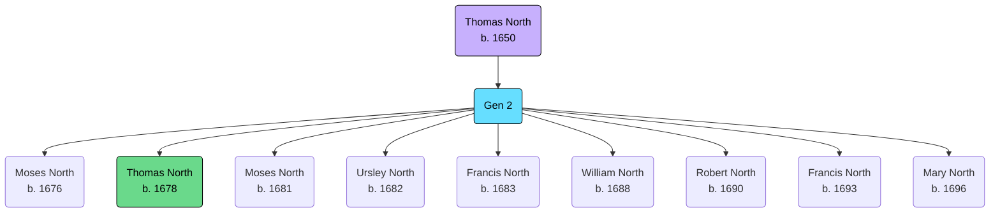

Born: c. 1650

## Parents
Unknown

## Siblings
Unknown

## Children
- [[NORTH, (1676) Moses|Moses North]]
- [[NORTH, (1678) Thomas|Thomas North]]
- [[NORTH, (1681) Moses|Moses North]]
- [[NORTH, (1682) Ursley|Ursley North]]
- [[NORTH, (1683) Francis|Francis North]]
- [[NORTH, (1688) William|William North]]
- [[NORTH, (1690) Robert|Robert North]]
- [[NORTH, (1693) Francis|Francis North]]
- [[NORTH, (1696) Mary|Mary North]]