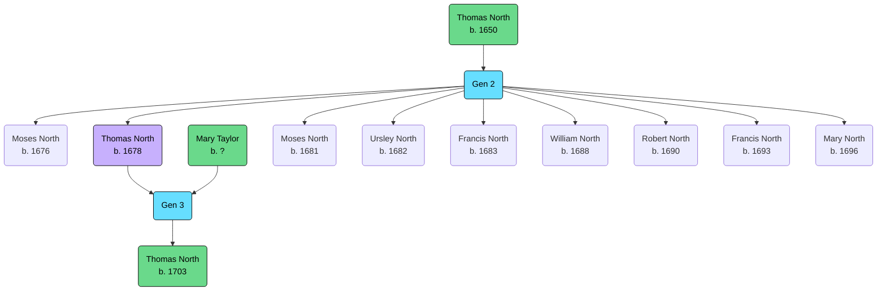

Born: 18 June 1678 (Buckingham, Buckinghamshire, England, United Kingdom)

Married: [[TAYLOR, Mary|Mary Taylor]], 1 May 1699

## Parents
- [[NORTH, (1650) Thomas|Thomas North]]

## Siblings
- [[NORTH, (1676) Moses|Moses North]]
- [[NORTH, (1681) Moses|Moses North]]
- [[NORTH, (1682) Ursley|Ursley North]]
- [[NORTH, (1683) Francis|Francis North]]
- [[NORTH, (1688) William|William North]]
- [[NORTH, (1690) Robert|Robert North]]
- [[NORTH, (1693) Francis|Francis North]]
- [[NORTH, (1696) Mary|Mary North]]

## Children
