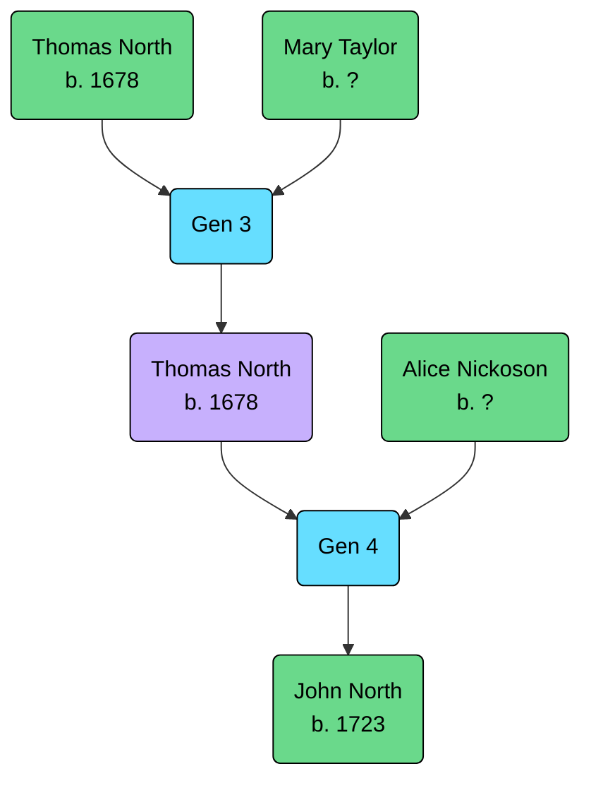

Born: 10 May 1703 (Buckingham, Buckinghamshire, England, United Kingdom)

Married: [[NICKOSON, Alice|Alice Nickoson]], 2 October 1721 (Buckingham, Buckinghamshire, England, United Kingdom)

## Parents
- [[NORTH, (1678) Thomas|Thomas North]]
- [[TAYLOR, Mary|Mary Taylor]]

## Siblings
Unknown

## Children
- [[NORTH, (1723) John|John North]]
- Other children unknown