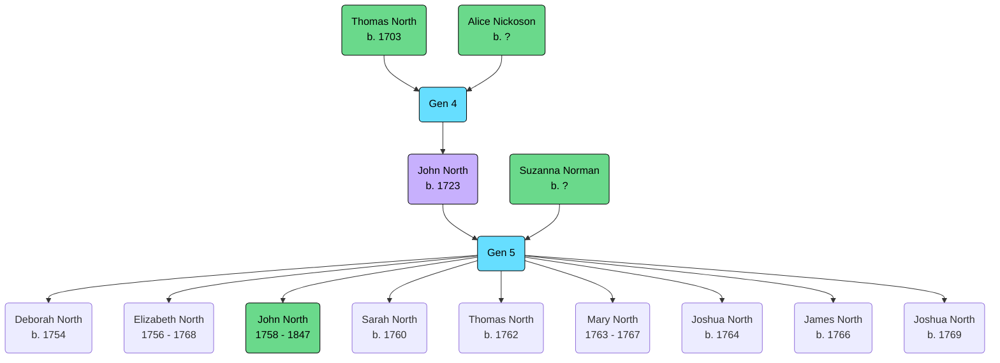

Born: 24 February 1723 (Buckingham, Buckinghamshire, England, United Kingdom)

Married: [[NORMAN, Suzanna|Suzanna Norman]], 11 February 1749 (Buckingham, Buckinghamshire, England, United Kingdom)

## Parents
- [[NORTH, (1703) Thomas|Thomas North]]
- [[NICKOSON, Alice|Alice Nickoson]]

## Siblings
Unknown

## Children
- [[NORTH, (1754) Deborah|Deborah North]]
- [[NORTH, (1756) Elizabeth|Elizabeth North]]
- [[NORTH, (1758) John|John North]]
- [[NORTH, (1760) Sarah|Sarah North]]
- [[NORTH, (1762) Thomas|Thomas North]]
- [[NORTH, (1763) Mary|Mary North]]
- [[NORTH, (1764) Joshua|Joshua North]]
- [[NORTH, (1766) James|James North]]
- [[NORTH, (1769) Joshua|Joshua North]]