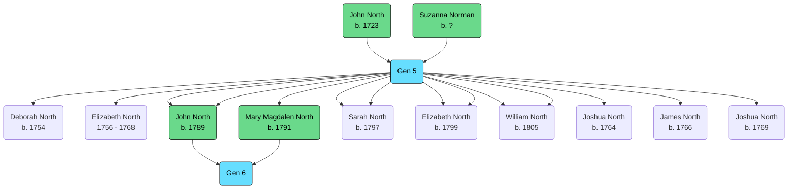

Born: 15 February 1758 (London, England, United Kingdom)

Baptised: 12 March 1758 (St. Matthew's Church, Bethnal Green, London, England, United Kingdom)[^1]

Married: [[PORTEUS, Mary Magdalen|Mary Magdalen Porteus]], 14 July 1787 (London, England, United Kingdom)[^2]

Death: 13 February 1847 (London, England, United Kingdom)[^3]

## Parents
- [[NORTH, (1723) John|John North]]
- [[NORMAN, Suzanna|Suzanna Norman]]

## Siblings
- [[NORTH, (1754) Deborah|Deborah North]]
- [[NORTH, (1756) Elizabeth|Elizabeth North]]
- [[NORTH, (1760) Sarah|Sarah North]]
- [[NORTH, (1762) Thomas|Thomas North]]
- [[NORTH, (1763) Mary|Mary North]]
- [[NORTH, (1764) Joshua|Joshua North]]
- [[NORTH, (1766) James|James North]]
- [[NORTH, (1769) Joshua|Joshua North]]

## Children
- [[NORTH, (1789) John|John North]]
- [[NORTH, (1791) Mary Magdalen|Mary Magdalen North]]
- [[NORTH, (1797) Sarah|Sarah North]]
- [[NORTH, (1799) Elizabeth|Elizabeth North]]
- [[NORTH, (1805) William|William North]]

[^1]: [[Baptisms At St Matthew's Bethnal Green (1756-1769)]]
[^2]: [[Marriage Record - John North & Mary Magdalen Porteus]]
[^3]: [[Death Record - John North (1758-1847)]]

