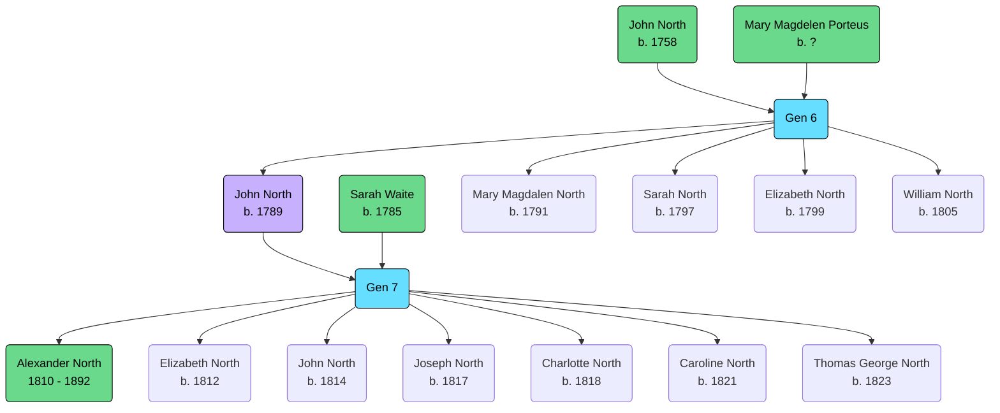

Born: 16th Aug 1789 (London, England, United Kingdom)

Married: [[WAITE, (1785) Sarah|Sarah Waite]], 18 October 1809 (Christ Church, Spitalfields, London, England, United Kingdom)[^1]

Occupation: Porter and warehouseman of Old Bethlehem

## Parents
- [[NORTH, (1758) John|John North]]
- [[PORTEUS, Mary Magdalen|Mary Magdalen Porteus]]

## Siblings
- [[NORTH, (1791) Mary Magdalen|Mary Magdalen North]]
- [[NORTH, (1797) Sarah|Sarah North]]
- [[NORTH, (1799) Elizabeth|Elizabeth North]]
- [[NORTH, (1805) William|William North]]

## Children
- [[NORTH, (1810) Alexander|Alexander North]]
- [[NORTH, (1812) Elizabeth|Elizabeth North]]
- [[NORTH, (1814) John|John North]]
- [[NORTH, (1817) Joseph|Joseph North]]
- [[NORTH, (1818) Charlotte|Charlotte North]]
- [[NORTH, (1821) Caroline|Caroline North]]
- [[NORTH, (1823) Thomas George|Thomas George North]]

[^1]: [[Marriage Record - John North & Sarah Waite]]
