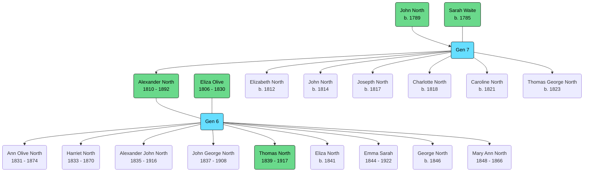

![[alexander-north-profile.png|300]]

Born: 6 May 1810 (Bishopsgate, London, England, United Kingdom)

Father: [[NORTH, (1789) John|John North]]

Mother: [[WAITE, (?) Sarah|Sarah Waite]]

Baptised: St. Botolphs-without-Bishopsgate (Bishopsgate, London, England, United Kingdom)

Occupation: Hairdresser

Married: [[OLIVE, (1806) Eliza|Eliza Olive]], 28 December 1830 (Christ Church, Spitalfields, London, England, United Kingdom)

Married: [[HAYDEN, (1836) Mary|Mary Hayden]], 10 June 1880 (Tonbridge, Kent, England, United Kingdom)[^1]

Died: 28 September 1892 (Tonbridge, Kent, England, United Kingdom)

## Children
- [[NORTH, (1831) Ann Olive|Ann Olive North]]
- [[NORTH, (1833) Harriet|Harriet North]]
- [[NORTH, (1835) Alexander John|Alexander John North]]
- [[NORTH, (1837) John George|John George North]]
- [[NORTH, (1839) Thomas|Thomas North]]
- [[NORTH, (1841) Eliza|Eliza North]]
- [[NORTH, (1844) Emma Sarah|Emma Sarah North]]
- [[NORTH, (1846) George|George North]]
- [[NORTH, (1848) Mary Ann|Mary Ann North]]

## Locations
- 1841 - [[Walnut Tree House]], Mayfield (1841 Census)
- 1861 - [[460 High Street, Tonbridge]]
- 1876 - [[35 High Street, Tonbridge]]

[^1]: [[Marriage Certificate - Alexander North & Mary Hayden]]
